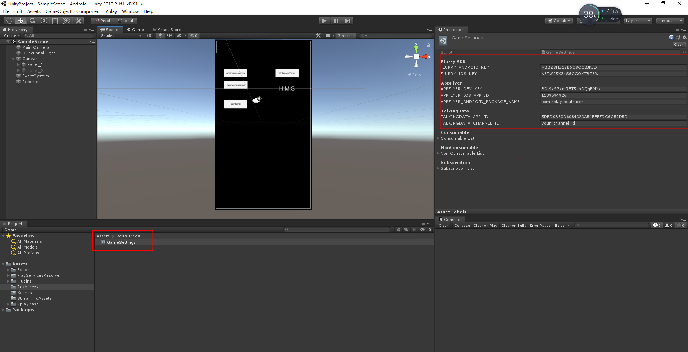

# Flurry、Appflyr、TalkingData plugin for Unity

## Appflyer
* Official website link：https://support.appsflyer.com/hc/en-us/articles/213766183-Unity-SDK-integration-for-developers
* This sdk contains statistics and add events
### To related function, call
* Initialize Appflyer： 
AppFlyerSDKManager.Instance.InitializeAppFlyer();  
* event：
AppFlyerSDKManager.Instance. AppFlyerLogEvent(string eventName, Dictionary<string, string> eventValues);

### Note: The secondary function is open for you. Please do not add your content to this function to avoid accidentally deleting the code you added by using dynamic deletion.

## Flurry
* Official website link：https://developer.yahoo.com/flurry/docs/integrateflurry/unity/
* This sdk contains statistics and add events  
### To related function, call
* Initialize Flurry：  
FlurrySDKManager.Instance.InitializeFlurry();
* Add Flurry Lister：  
FlurrySDKManager.Instance.SetFlurryLister();
* Event：
1) FlurrySDKManager.Instance. FlurryLogEvent(string eventId, bool timed = false);    
2) FlurrySDKManager.Instance. FlurryLogEvent(string eventId, Dictionary<string, string> parameters, bool timed = false);    
3) FlurryEndTimedEvent(string eventId, Dictionary<string, string> parameters);    

Please refer to FlurrySDKManager.cs for details.

## DalkingData
* [Official website link](Unity_DalkingData.md)
* This sdk contains statistics and add events  
### To related function, call  
* Initialize DalkingData：    
TalkingDataSDKManager.Instance.InitializeTalkingData();
* Eevent：  
TalkingDataSDKManager.Instance.TalkingDataLogEvent(string eventId,Dictionary<string,object> parameters);

### Note: Flurry、 Appflyer、Talking Data statistics sdk related keys or parameters need to be filled in this .asset file

### If you add this sdk, please click the Setting Manager/Analysis... under the Editor zplay tab to create the AnalysisSetting.asset file.

