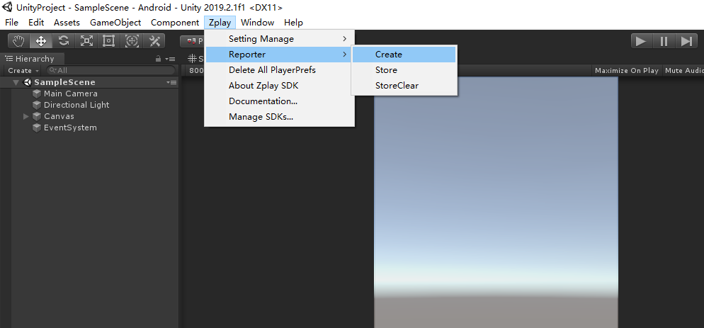
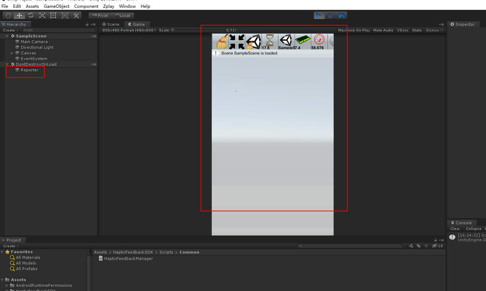

# Unity-logs-Viewer plugin for Unity
* This is a log log plugin that can be viewed on the phone screen.
* mport unity-logs-Viewer in the zplay SDK Manager window panel
* Add screen log prefab, default to open the output log on the screen

* Close the screen output log and click Store button，Open the screen output log and click StoreCleear button
* After the above steps are added, launch the application and you need to circle on the square meter to open it. as shown in the figure below.

