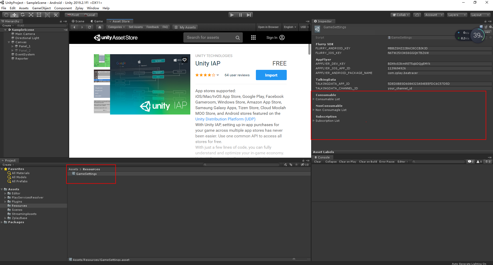

# ZplayBaseeSDK plugin for Unity   

* Includes IOS and Android payment and subscription features  
* Includes IOS and Android logins, display leaderboards, impression achievements, upload leaderboard scores, upload achievement completions  
* Access to login and leaderboards requires google to import the google play game API  
* Link：https://github.com/playgameservices/play-games-plugin-for-unity#configure-your-game
* Access payment needs to import Unity IAP into the Asset store, Window/Package Manager panel to import In APP Purchasing  
* Fill in the payment id, please click Zplay/Setting Manager/Purchaseers...  
* Consumabie：
__Consumption type billing point__
* NonConSumable：
__Non-consumable type billing point__  
* Subscription：
__Subscription type billing point__  

## To related function, call:  
### Pay
* Initialize：       
__PurchaserManager.Instance.Initialize();__    
* Price：   
__Product=PurchaserManager.Instance.OnProductPrice(string productId);__
* Pay：  
__PurchaserManager.Instance. BuyProductId(String productId, String source = "Shop") //source should be provided in a better way__
* RestorePurchases：  
__PurchaserManager.Instance. RestorePurchases(String productId, String source = "Shop")__
* Pay callcack：  
__Whether the initialization was successful__  
PurchaserManager.Initialized += Initialized;   
__Payment start__
PurchaserManager.PurchaseStarted += PurchaseStarted;  
__Successful payment, paying rewards in the callback__
PurchaserManager.PurchaseSucceeded += PurchaseSucceeded;  
__Payment failed__  
PurchaserManager.PurchaseFailed += PurchaseFailed;   

### Note: If you don't know, please check out PurchaserManager.cs.

### Subscription  
* Detect if the incoming subscription id is in the subscription state and return whether it is in the subscription state
SubscriptionController.Instance. CheckSubscription(String subscriptionId,Action<Boolean> subscriptionCallback);

### Note: Please refer to the SubscriptionController.cs for your specific

### Login, leaderboard
* Initialize  
__Initialize Social Networks__   
SocialNetworksManager.Instance.Initialize();   
* ShowAchievementsUI   
__Show achievements__    
SocialNetworksManager.Instance. ShowAchievementsUI(Action<Boolean> callback = null);   
* UnlockAchievements   
__Unlock now successfully__   
UnlockAchievements: SocialNetworksManager.Instance. UnlockAchievements(String achievementId,Action<Boolean> callback = null);   
__Cumulative unlock achievement__   
UnlockAchievements: SocialNetworksManager.Instance. UnlockAchievements(String achievementId,int steps ,Action<Boolean> callback = null);
* ShowLeaderboardUI
__Show leaderboards, such as transferring leaderboardId to display a single leaderboard, and not transmitting to show all leaderboards__    
* ReportLeaderboard
__Metadata ==null is more ID submitted leaderboard score, !=null is more id and metadata label submission ranking__   
SocialNetworksManager.Instance.ReportLeaderboard(string leaderboard,long score,Action<Boolean> callback = null,String metadata = null); 

### Note: See SocialNetworksManager.cs for details.

